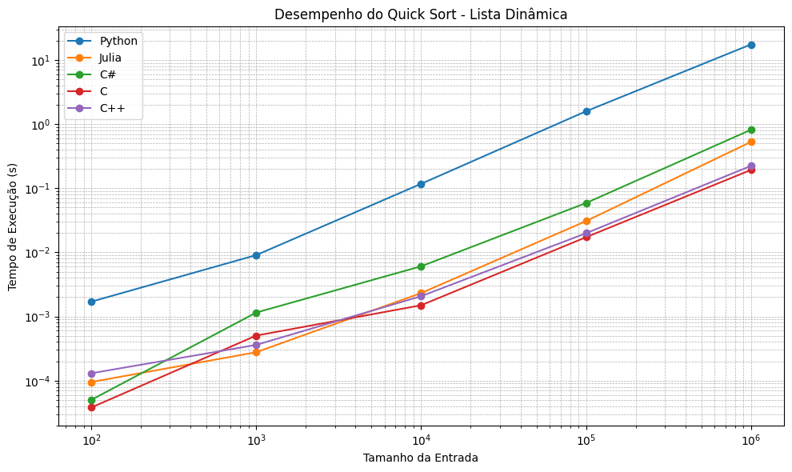
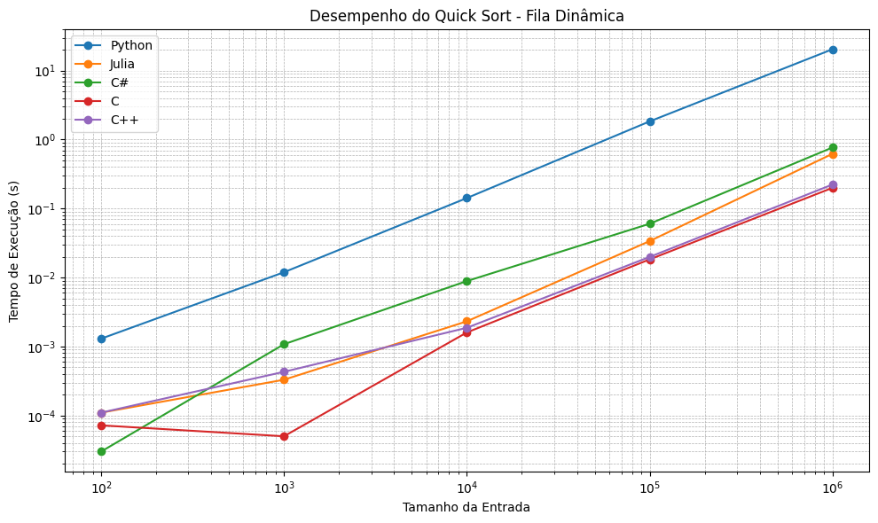
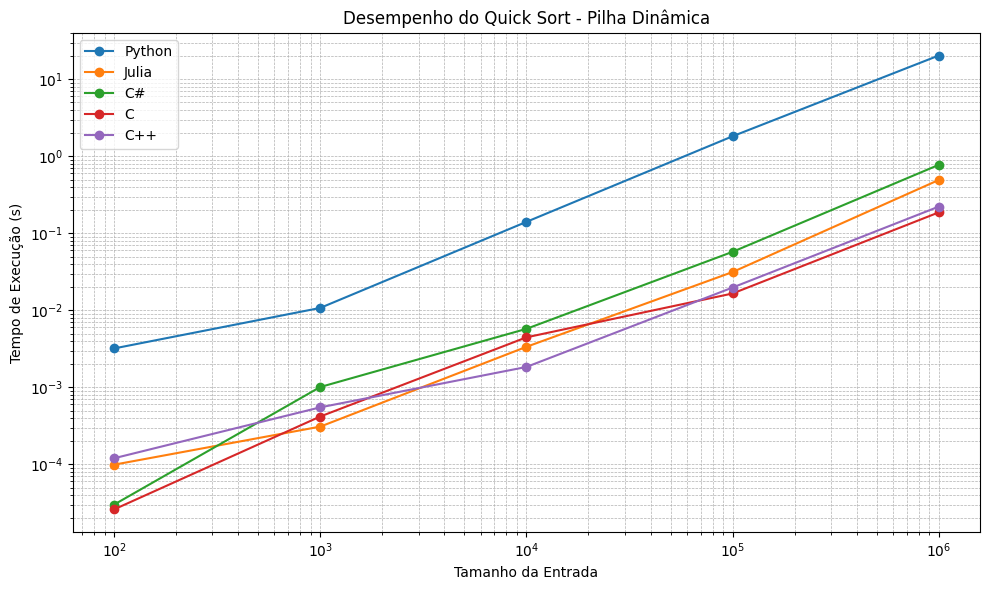
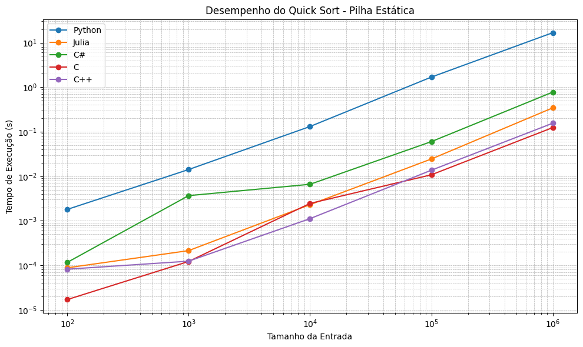
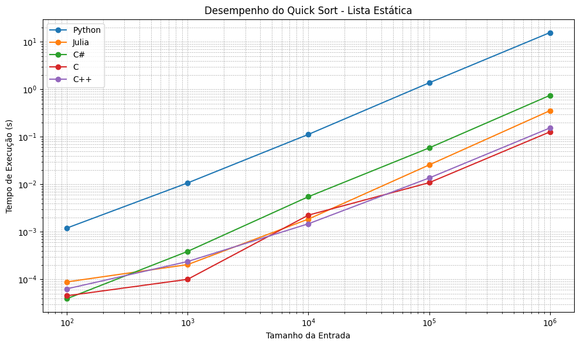
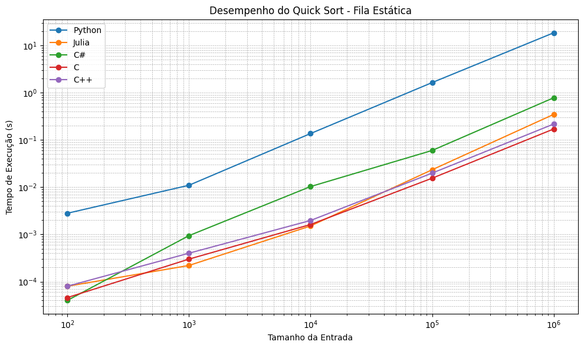
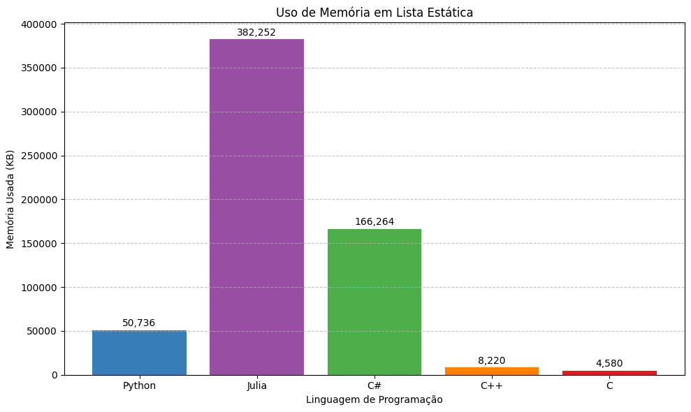
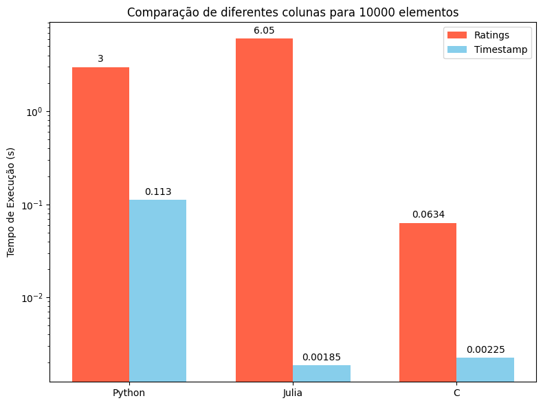

# 📝 Projeto QuickSort Multilínguas e Estruturas de Dados

## 📖 Sobre o Projeto  
Este projeto, desenvolvido como trabalho universitário, analisa **o desempenho do algoritmo Quick Sort** em diferentes linguagens de programação (C, C++, C#, Python e Julia) e estruturas de dados (lista, pilha e fila, em versões estáticas e dinâmicas). O foco é comparar tempos de ordenação usando como base os *timestamps* do arquivo `ratings.csv` do conjunto MovieLens 25M. O experimento inclui todo o *pipeline* de ordenação – extração, ordenação e reinserção – e foi executado em volumes de 100 a 1.000.000 de registros em três cenários de ordem inicial.
---

## 🎬 Visualização do Algoritmo QuickSort


Esta animação demonstra **o núcleo operacional do QuickSort**: o processo de particionamento (*partitioning*), que caracteriza sua eficiência.

### 🔍 Mecânica do Particionamento:
1. **Seleção do Pivô**:  
   Um elemento é escolhido como referência (aqui usando **mediana de três** - primeiro/meio/último elementos).

2. **Rearranjo dos Elementos**:  
   - Elementos **menores que o pivô** são movidos para sua esquerda  
   - Elementos **maiores que o pivô** são movidos para sua direita  
   - O pivô assume sua posição final correta após este processo  

3. **Divisão Recursiva**:  
   O algoritmo é aplicado recursivamente às duas partições resultantes:
   - Sub-lista esquerda (elementos ≤ pivô)  
   - Sub-lista direita (elementos ≥ pivô)  

### ⚡ Princípios Operacionais Visíveis:
- **Operação In-place**: A reorganização ocorre na própria estrutura, sem estruturas auxiliares  
- **Eficiência Assimétrica**: Partições de tamanhos diferentes são processadas independentemente  
- **Convergência Ordenada**: Cada passo coloca pelo menos um elemento (o pivô) em sua posição definitiva  
  


<div align="center" style="background: linear-gradient(135deg, #f5f7fa 0%, #c3cfe2 100%); padding: 2rem; border-radius: 15px; box-shadow: 0 10px 20px rgba(0,0,0,0.1);">

## 👥 Equipe do Projeto

| **Alunos** | **Professor** |
|:----------:|:-------------:|
| <div style="display: flex; flex-wrap: wrap; justify-content: center; gap: 15px; max-width: 600px;"><div style="flex: 1 0 180px;"><a href="https://github.com/alvaroajs"></a><br>**Álvaro Silva**<br>[](https://github.com/alvaroajs)</div><div style="flex: 1 0 180px;"><a href="https://github.com/ImArthz"></a><br>**Arthur Mendonça**<br>[](https://github.com/ImArthz)</div><div style="flex: 1 0 180px;"><a href="https://github.com/Rutrama"></a><br>**Arthur Santana**<br>[](https://github.com/Rutrama)</div></div><div style="display: flex; flex-wrap: wrap; justify-content: center; gap: 15px; margin-top: 15px;"><div style="flex: 1 0 180px;"><a href="https://github.com/msjujubr"></a><br>**Júlia D'Moura**<br>[](https://github.com/msjujubr)</div><div style="flex: 1 0 180px;"><a href="https://github.com/LuizFernandosq"></a><br>**Luiz Fernando**<br>[](https://github.com/fernando-horita-siratuti)</div></div> | <a href="https://github.com/mpiress"></a><br>**Prof. Michel Pires**<br>[](https://github.com/mpiress) |

</div>


## ⚙️ Resumo Técnico  

### O Algoritmo Quick Sort  
- **Divide e conquista**: escolhe um pivô, particiona elementos menores e maiores, e aplica-se recursivamente.  
- **In-place**: não requer espaço auxiliar significativo.  
- **Complexidade média**: O(n log n); pior caso O(n²) com pivôs mal escolhidos.

### Estratégias de Pivô  
- **Mediana de Três**: mediana entre primeiro, meio e último elementos; evita partições desbalanceadas.  
- **Bandeira Holandesa** (3-way): particiona em menores, iguais e maiores em uma única passagem – recomendado para muitos valores repetidos.

### Metodologia Experimental  
1. **Extração**: dados da estrutura original (lista, pilha, fila) para vetor auxiliar.  
2. **Ordenação**: Quick Sort (mediana de três) usando campo *timestamp*.  
3. **Reinserção**: cópia dos dados ordenados de volta à estrutura original.  
4. **Medição de tempo**: inclui extração, ordenação e reinserção.


- **Volumes testados**: 100, 1.000, 10.000, 100.000 e 1.000.000 registros.  
- **Cenários**: original, pré-ordenado e inversamente ordenado.  
- **Execuções**: 10 repetições por combinação (estrutura × volume × cenário).  
## **Ambiente**: 
- Intel® Core™ i7-8550U × 8
- 16.0GiB DDR4 3200 MHz
- Ubuntu 24.04.1 LTS
- C, C++, C\#, Python, Julia

## 📊 Resultados de Desempenho  

### 📈 Gráfico: Desempenho do Quick Sort em Lista Dinâmica



Este gráfico mostra o **tempo de execução** (eixo Y, escala logarítmica) do Quick Sort aplicado a uma **lista dinâmica** contendo de **10² até 10⁶** elementos (eixo X, escala logarítmica) nas cinco linguagens avaliadas:

- 🔵 **Python**  
- 🟠 **Julia**  
- 🟢 **C#**  
- 🔴 **C**  
- 🟣 **C++**  

### Principais observações

1. **C e C++** (🔴🔵) mantêm os menores tempos em todos os tamanhos de entrada, evidenciando a eficiência de código compilado de baixo nível.  
2. **C# e Julia** (🟢🟠) ficam na faixa intermediária: ambas se beneficiam de compilação JIT, mas ainda não alcançam C/C++.  
3. **Python** (🔵) apresenta o maior tempo de execução, especialmente em entradas grandes, chegando a ser **duas ordens de magnitude** mais lento que C/C++.  
4. A inclinação das curvas indica que todos seguem a tendência assintótica \(O(n\log n)\), mas o **coeficiente** (constante multiplicativa) é muito maior em linguagens interpretadas.  
5. Entre as linguagens JIT, **Julia** quebra o engarrafamento de Python em grandes volumes e se aproxima de C#, mostrando seu potencial em tarefas numéricas.


### 📈 Gráfico: Desempenho do Quick Sort em Fila Dinâmica



Este gráfico exibe o **tempo de execução** (eixo Y, log) do Quick Sort em uma **fila dinâmica** para entradas de **10² a 10⁶** elementos (eixo X, log).

- 🔵 **Python** domina os piores tempos, crescendo rapidamente com o tamanho da entrada.  
- 🔴 **C** tem o menor tempo inicial (10²), mas fica próximo de C++ em médias grandes.  
- 🟣 **C++** mostra consistência, com leves ganhos sobre C em baixas entradas.  
- 🟢 **C#** alcança desempenho intermediário, escalando melhor que Python porém atrás de JITs.  
- 🟠 **Julia** fica entre C# e Python, demonstrando vantagem sobre Python em grandes volumes.

> **Insight:** Para operações FIFO em que a performance de ordenação é crítica, C/C++ ofertam realocação mais eficiente dos elementos.  

---

### 📈 Gráfico: Desempenho do Quick Sort em Pilha Dinâmica



Neste gráfico, vemos o **tempo de execução** em uma **pilha dinâmica** com entradas de **10² a 10⁶**:

- 🔵 **Python** segue como a mais lenta, mas a inclinação da curva confirma o comportamento \(O(n\log n)\).  
- 🔴 **C** e 🟣 **C++** estão muito próximos, com C ligeiramente à frente em grandes entradas.  
- 🟢 **C#** e 🟠 **Julia** mostram ganhos sobre Python, mas continuam acima de C/C++.  
- No caso de pilha dinâmica, a diferença entre C e C++ é menor que em filas, indicando que a estrutura LIFO reduz parte do overhead de realocação.

> **Dica:** Estruturas LIFO podem ser mais eficientes que FIFO para Quick Sort, pois a reinserção não exige inversão de ordem completa.  

---

### 📈 Gráfico: Desempenho do Quick Sort em Pilha Estática



O gráfico abaixo compara o **tempo de execução** em uma **pilha estática** (vetor LIFO) de **10² a 10⁶** elementos:

- 🔴 **C** apresenta tempos extremamente baixos em pequenas entradas, graças ao acesso direto ao vetor.  
- 🟣 **C++** acompanha de perto, ultrapassando C em baixas entradas em alguns pontos.  
- 🟢 **C#** e 🟠 **Julia** iniciam acima de C/C++, mas escalam de forma linear na mesma tendência.  
- 🔵 **Python** continua o mais lento, porém a distância relativa para C/C++ diminui um pouco em médias de entrada (10³–10⁴).  
- A pilha estática reafirma que operações em vetores fixos têm **custo de acesso constante**, tornando-as muito eficientes para Quick Sort.
- 
### 📊 Gráfico: Desempenho do Quick Sort em Lista Estática



Este gráfico apresenta o **tempo de execução** (eixo Y, log) do Quick Sort em uma **lista estática** para entradas de **10² a 10⁶** elementos (eixo X, log):

- 🔵 **Python**: curva mais íngreme, confirmando maior coeficiente nos custos de ordenação.  
- 🔴 **C** e 🟣 **C++**: melhores tempos em todas as escalas, com pequenas diferenças entre si.  
- 🟢 **C#** e 🟠 **Julia**: desempenho intermediário, escalando linearmente na mesma tendência \(O(n\log n)\).  

---

## 📈 Gráfico: Desempenho do Quick Sort em Fila Estática



Este gráfico apresenta o **tempo de execução** (eixo Y, logarítmico) do Quick Sort em uma **fila estática** (vetor FIFO) para tamanhos de entrada de **10²** a **10⁶** elementos (eixo X, logarítmico):

- 🔵 **Python**: mantém a curva mais alta e íngreme, refletindo seu maior overhead de interpretação e manipulação de listas.  
- 🔴 **C**: lidera em pequenas entradas e escala de forma consistente, com baixo tempo de acesso direto ao vetor.  
- 🟣 **C++**: muito próximo de C em todos os pontos, às vezes ligeiramente acima em entradas muito pequenas.  
- 🟢 **C#** e 🟠 **Julia**: ocupam o meio da tabela—ambas JIT, aproveitam otimizações em tempo de execução, mas não igualam C/C++.  

### Insights principais

1. **Operações FIFO em vetor** preservam ordenação original com acesso constante, resultando em tempos semelhantes ao de pilha estática.  
2. A **diferença entre C e C++** permanece mínima, reforçando escolhas de compilador e otimizações similares.  
3. Linguagens **JIT** (C#, Julia) têm desempenho competitivo em médias grandes, mas ainda ficam atrás de compiladas nativas.  


### 🧠 Gráfico: Uso de Memória em Lista Estática



Este gráfico mostra a **quantidade de memória** (em KB) utilizada pelo Quick Sort em uma **lista estática** contendo 100.000 elementos, nas cinco linguagens:

- 🔵 **Python**: ~50 736 KB  
- 🟠 **Julia**: ~382 252 KB  
- 🟢 **C#**: ~166 264 KB  
- 🟣 **C++**: ~8 220 KB  
- 🔴 **C**: ~4 580 KB  

> **Insight:**  
> - Linguagens JIT (Julia, C#) consumiram muito mais memória que compiladas nativas.  
> - **C** e **C++** mantêm footprint de memória extremamente reduzido, reforçando sua eficiência em ambientes de recursos limitados.


### 🔄 Gráfico: Comparação Ratings vs. Timestamp (10 000 elementos)



Aqui comparamos o **tempo de execução** (escala log) do Quick Sort usando duas colunas diferentes do mesmo conjunto de 10 000 registros:

- **Ratings** (avaliações de 0–5):  
  - Python: 3,00 s  
  - Julia: 6,05 s  
  - C:    0,0634 s  
- **Timestamp** (selos de data/hora):  
  - Python: 0,113 s  
  - Julia: 0,00185 s  
  - C:    0,00225 s  

> **Conclusão:**  
> - Colunas com **muitos valores repetidos** (Ratings) degradam fortemente o desempenho, chegando a ser **milhares de vezes** mais lentas que colunas de timestamp.  
> - O uso da **mediana de três** não contorna totalmente o problema de chaves pouco diversas; para cenários com alta repetição, recomenda‑se particionamento 3‑way.

## 📚 Documentação Técnica Completa

Para uma análise detalhada do projeto, incluindo fundamentação teórica, metodologia experimental completa e discussão aprofundada dos resultados, consulte nosso relatório técnico:

[](https://github.com/alvaroajs/ordenacaoAEDS/blob/main/assets/pdf/Quicksort.pdf)  
**Quicksort: Análise Multilíngua em Estruturas de Dados**  
*(Autores: Álvaro Silva, Arthur Mendonça, Arthur Santana, Júlia D'Moura, Luiz Fernando)*

Este documento de 10 páginas contém:
- Contexto histórico e fundamentação matemática do algoritmo
- Pseudocódigo completo da implementação com mediana de três
- Análise estatística detalhada dos resultados
- Discussão sobre aplicações práticas
- Limitações e trabalhos futuros


## 📂 ESTRUTURA DO PROJETO
```text
projeto-aeds-quicksort/
├── C/                  # Implementação em C
│   └── main.c
├── C++/                # Implementação em C++
│   └── main.cpp
├── C#/                 # Implementação em C# 
│   └── ConsoleApp1/
│       ├── Program.cs
│       └── Quicksort.csproj
├── julia/              # Implementação em Julia
│   └── main.jl
├── python/             # Implementação em Python
│   └── main.py
└── data/               # Dados compartilhados
    └── ratings.csv     # Dataset obrigatório
```
# 🚀 COMO EXECUTAR

## 🔹 PRÉ-REQUISITOS COMUNS
- Arquivo `ratings.csv` na pasta `data/`
- Formato: `userId,movieId,rating,timestamp`

## 📋 MENU DE IMPLEMENTAÇÕES
```bash
| Linguagem  | Comando de Execução                      | Dependências   |
|------------|------------------------------------------|----------------|
| C          | `./C/quicksort_c`                        | GCC 9.0+       |
| C++        | `./C++/quicksort_cpp`                    | G++ 9.0+       |
| C#         | `dotnet run --project C#/ConsoleApp1`    | .NET 9.0+      |
| Julia      | `julia julia/main.jl`                    | Julia 1.6+     |
| Python     | `python python/main.py`                  | Python 3.8+    |
```
## 🧹 LIMPEZA DE ARQUIVOS TEMPORÁRIOS

### 🔧 Limpeza Geral (todas linguagens)
```bash
# Remove binários, objetos e caches
find . -type d \( -name "bin" -o -name "obj" -o -name "__pycache__" -o -name "*.o" -o -name "*.out" \) -exec rm -rf {} +
```

### 🔍 Limpeza Específica por Linguagem

| Linguagem  | Comando de Limpeza                          |
|------------|---------------------------------------------|
| **C**      | `rm -f C/*.o C/quicksort_c`                 |
| **C++**    | `rm -f C++/*.o C++/quicksort_cpp`           |
| **C#**     | `rm -rf C#/ConsoleApp1/{bin,obj}`           |
| **Julia**  | `rm -f julia/*.jl.*.cov julia/*.jl.mem`     |
| **Python** | `rm -rf python/__pycache__`                 |

### 💡 Dicas Adicionais
1. Para Windows (PowerShell):
   ```powershell
   Remove-Item -Recurse -Force bin, obj, __pycache__
   ```
2. Para limpar todos os arquivos gerados:
   ```bash
   make clean  # Se estiver usando Makefile
   ```

## 📌 DICAS IMPORTANTES

### 🧠 Teste de Consumo de Memória

```bash
# Julia
/usr/bin/time -v julia julia/main.jl

# C
/usr/bin/time -v ./C/quicksort_c

# C++
/usr/bin/time -v ./C++/quicksort_cpp

# C# (Linux/Mac)
dotnet run --project C#/ConsoleApp1 & /usr/bin/time -v wait $!

# Python
/usr/bin/time -v python python/main.py

# Windows (PowerShell)
Measure-Command { dotnet run --project C#/ConsoleApp1 }
```

## 📦 Onde Baixar o Dataset

⚠️ **Use EXATAMENTE este dataset oficial para garantir consistência nos testes:**  

- [](https://grouplens.org/datasets/movielens/25m/)  
- [](https://files.grouplens.org/datasets/movielens/ml-25m.zip) (≈250 MB)  


### Passos:
1. **Acesse o link acima**  
2. **Clique em "ml-25m.zip"** (≈250MB)  
3. **Extraia o arquivo `ratings.csv`** para a pasta `/data` do seu projeto

### Verificação:
```bash
# Confira se o arquivo está correto (primeiras linhas):
head -n 5 data/ratings.csv
# Saída esperada:
# userId,movieId,rating,timestamp
# 1,296,5.0,1147880044
# 1,306,3.5,1147868817
```

